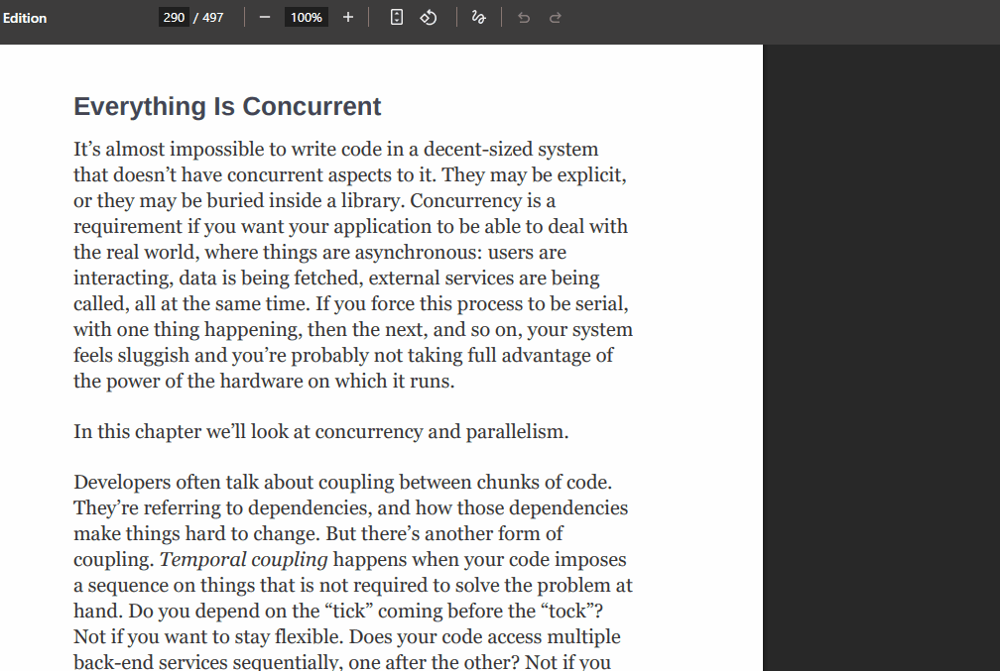

<p align="right"><a href="README.pt-BR.md">Português</a></p>

# EzTranslator

Instant translation, in a dynamic popup, anywhere on your PC. Press a global hotkey from anywhere and a small popup opens near your cursor — from hotkey to result, your hands never leave the keyboard.



## Features

- Lives in the system tray, starts instantly, stays out of the way
- Global hotkey (default **Shift+Alt+T**, rebindable) opens a popup near your cursor
- Auto-detects the source language, or pick one manually from the dropdown
- Auto-translates as you type (after a short pause) or on Enter — no extra clicks
- `Ctrl+S` swaps source/target instantly while the popup is open (or use the swap button)
- Clear the input instantly with the inline `×` button or `Ctrl+D`
- Also reads your clipboard automatically, if you'd rather not type at all
- Copy button on the result field (or `Ctrl+C` while the popup is open), with a quick "Copied!" confirmation
- Long translations scroll instead of spilling out of the popup
- Closes on `Esc` or by clicking outside the popup
- Settings window: default languages, hotkey capture (click the field, press the new combo), start-with-Windows toggle
- Fully ephemeral — nothing about your translations is logged, stored, or kept in any history
- Currently Windows only

Translation is powered by Google Translate (via [deep-translator](https://github.com/nidhaloff/deep-translator)), free, no API key required.

## Install

Grab the latest release from the [releases page](https://github.com/LuizBrunca/EzTranslator/releases/latest) — two options:

- **`EzTranslator-Setup-x.x.x.exe`** (recommended): a proper Windows installer — Start Menu shortcut, optional desktop icon, clean uninstall.
- **`EzTranslator.exe`**: a portable single-file executable, no install step, just run it.

> **Note:** since neither is code-signed, Windows Defender SmartScreen may warn on first launch ("Windows protected your PC"). Click **More info** → **Run anyway**.

To start EzTranslator automatically on login, enable **Start with Windows** in the tray menu's Settings.

## Updating

**If you used the installer:** just run the new `EzTranslator-Setup-x.x.x.exe` — it closes the running app and overwrites the install in place.

**If you're on the portable exe:**

1. Quit EzTranslator first (right-click the tray icon → **Quit**) — Windows won't let you overwrite a running `.exe`.
2. Download the new `EzTranslator.exe` from the [latest release](https://github.com/LuizBrunca/EzTranslator/releases/latest).
3. Replace the old file with the new one, **at the same path and filename**.
4. Run it. Settings, saved languages, and your custom hotkey are untouched — they live in `%LOCALAPPDATA%\EzTranslator\`, separate from the executable.

If **Start with Windows** is enabled, it points at the exe's exact path — overwriting in place keeps it working with no extra steps. If you save the new download somewhere else (different folder or filename) instead, toggle **Start with Windows** off and back on in Settings so it points at the new location.

## Development

Requires [uv](https://docs.astral.sh/uv/) and Python 3.12+.

```powershell
git clone https://github.com/LuizBrunca/EzTranslator.git
cd EzTranslator
uv sync
uv run translator-app
```

### Project structure

```text
src/translator_app/
├── main.py              # Entry point — wires tray, popup, hotkey listener, settings
├── tray.py               # System tray icon and menu
├── hotkey_listener.py     # Global hotkey registration (pynput)
├── single_instance.py    # Prevents running more than one copy at once
├── startup.py             # Windows "start on boot" registry toggle
├── config.py              # Paths + config.json load/save
├── logger.py               # Rotating file logger
├── ui/
│   ├── popup.py            # The translation popup
│   └── settings.py         # Settings window
├── translator/
│   ├── engine.py            # GoogleTranslator wrapper
│   ├── worker.py             # Runs translation on a background QThread
│   └── languages.py          # Curated language list
└── assets/
    └── app.ico
```

### Building the executable

```powershell
uv run pyinstaller run.py --name EzTranslator --onefile --windowed --icon src/translator_app/assets/app.ico --add-data "src/translator_app/assets/app.ico;translator_app/assets" --version-file version_info.txt --noconfirm
```

Produces `dist/EzTranslator.exe` (single-file, windowed, no console).

## License

MIT — see [LICENSE](LICENSE).
